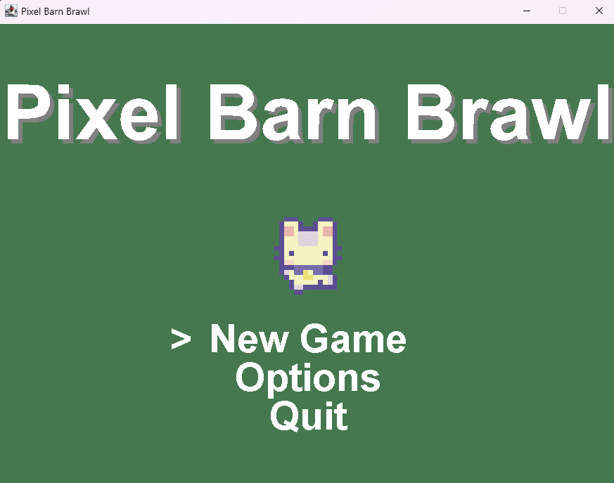
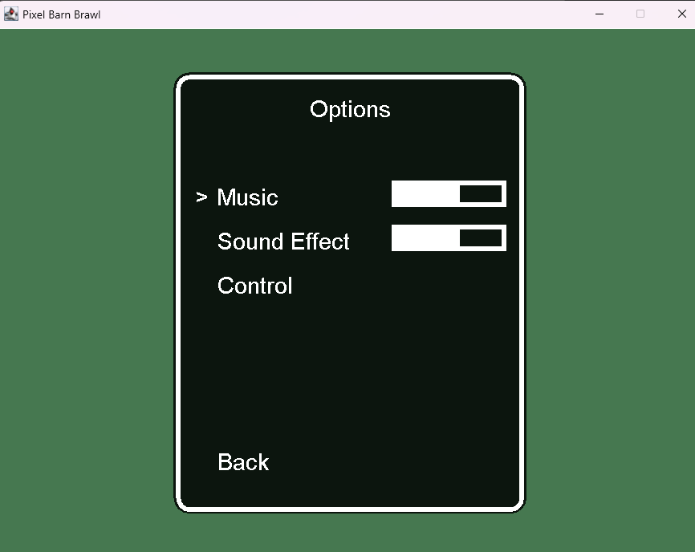
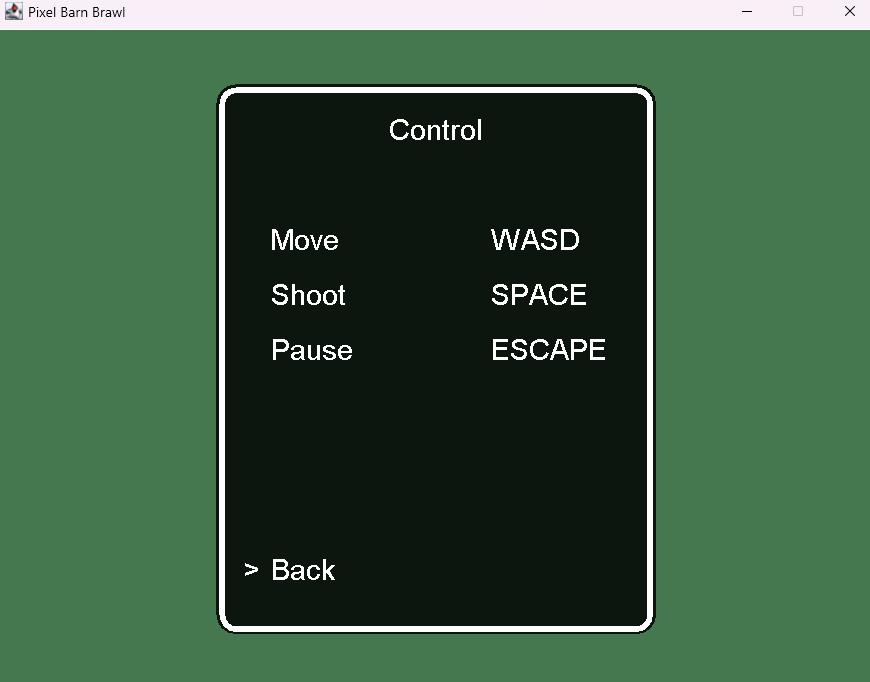
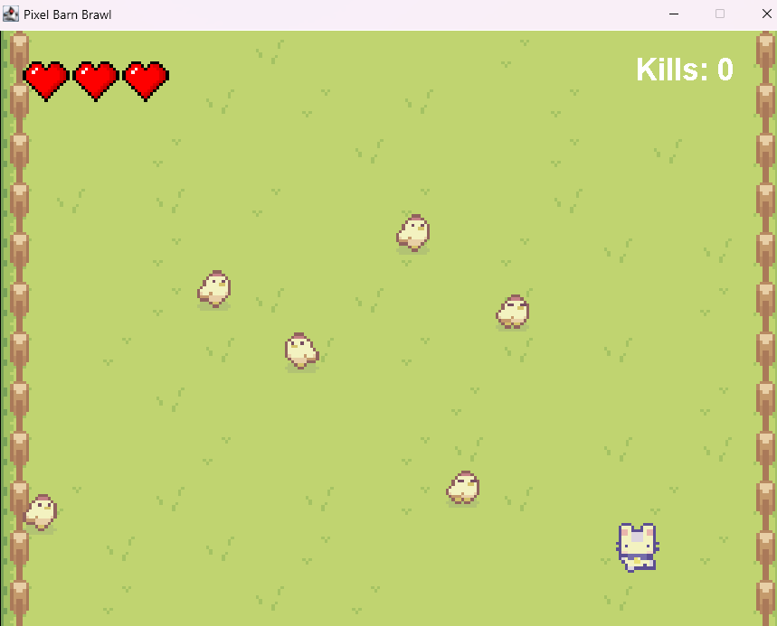
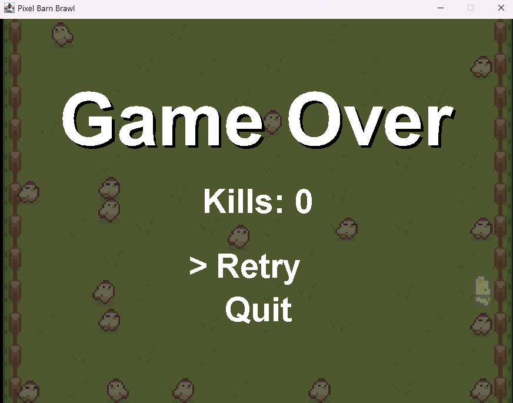

# Simple Shooter Game 🕹️
Hi! 👋 This is my first time coding a game in Java, and I'm excited to share it with you! 🎉

## About the Game
This is a simple 2D shooter game where you can:
- Move around to dodge enemies.
- Avoid losing health by not colliding with chickens.

## Game Features
- Player Character: A cat 🐱 with 3 hearts.
- Enemies: Chickens 🐔 that walk around. If you collide with them, you lose health.
## How to Play
- Download the game and run it.
- Use the keyboard controls to move around.
- Avoid the chickens to stay alive as long as you can!

## Images and Video
### Screenshots

### Gameplay Video
https://youtu.be/JnlZASc74xM

## Installation
- Clone this repository:
  git clone https://github.com/Triscoc/My-Java-Game.git
- Compile and run the project in your preferred Java IDE or using the terminal:
  - javac Main.java
  - java Main
## Contributing
This is just the beginning of my game development journey! If you have suggestions or find any issues, feel free to open an issue or submit a pull request.

# 簡單射擊遊戲 🕹️
嗨！👋 這是我第一次用 Java 編寫遊戲，並且很高興能與大家分享！🎉

## 關於遊戲
這是一款簡單的 2D 射擊遊戲，你可以：
- 移動角色來躲避敵人。
- 避免與雞碰撞以保持生命值。

## 遊戲特色
- 玩家角色：一隻有 3 顆心的貓 🐱。
- 敵人：雞 🐔 會隨機走動。若與牠們碰撞，你會失去生命值。

## 如何遊玩
- 下載遊戲並運行。
- 使用鍵盤控制角色移動。
- 避免與雞碰撞，盡可能長時間地生存下來！

## 圖片與影片
### 截圖

### 遊戲影片
https://youtu.be/JnlZASc74xM

## 安裝
- 複製此存儲庫：
  git clone https://github.com/Triscoc/My-Java-Game.git
- 在你的 Java IDE 或終端編譯並運行項目：
  - javac Main.java
  - java Main

## 貢獻
這是我遊戲開發旅程的起點！如果你有任何建議或發現問題，歡迎提出問題或提交拉取請求。
